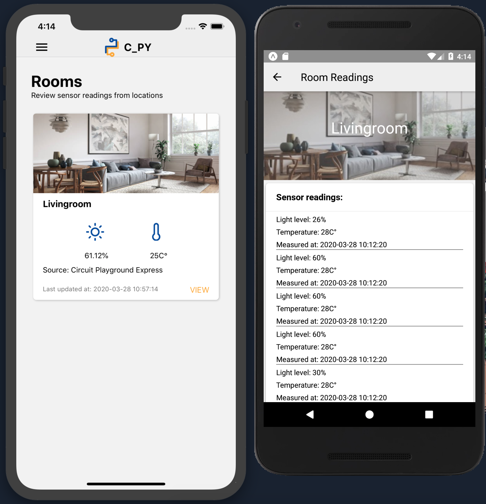

<<<<<<< HEAD

# This is a React-Native-Expo application to display data coming from the API

Currently it is rather simple, only fetching data from the node.js API deployed on Heroku and displaying it in a list
(will be updated with charts to visualize data and make it more interactive)

1. npm install
2. expo start
=======
# React-Native-Expo Application for reading data from circuitboard-API(Node.js-Express)
>>>>>>> def8d3709857afb8af589425f0de04b5998e0789
