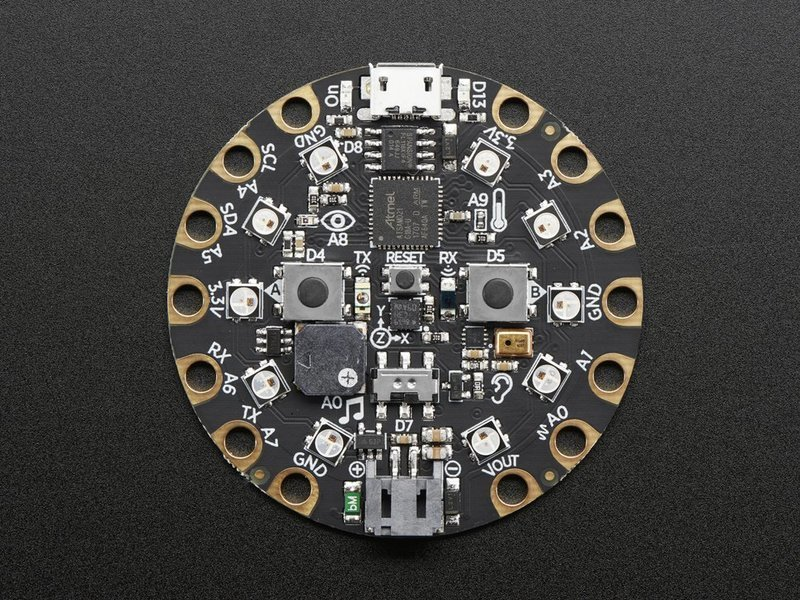

https://www.adafruit.com/product/3333

# This is circuitpython
 Circuit Playground Express Data Time/Light Intensity/Temperature
 Log data to a CSV on-screen
 Open CSV file beforehand
 Use slide switch to start and stop sensor readings
 Time values are seconds since board powered on (relative time that's why we change that value with the python script when making JSON)

 1. Plug in circuitboard to your laptop
 2. Load the script on the board
 3. Open CSV file
 4. Turn on device (D7 slide switch)